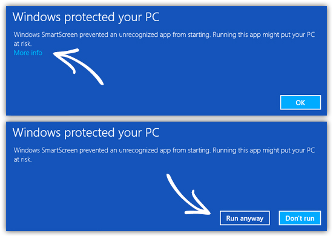

<center>
  
  <h1>
    Akaneia Updater
  </h1>
</center>

## F.A.Q.

> **Windows protected your PC**, what do I do ?



> My antivirus tells me it isn't safe, is it?

Since we don't pay a very expensive certificate, we're considered as unknown developers thus some antiviruses choose not to trust the progam. We can guarantee you that there isn't any malware hidden in it and the code is fully open if anyone wants to make sure there isn't.

> Why isn't there a macOS release?

MacOS only allows you to install signed application, to get a signing certificate we need to join their developper program which we're not in yet. If someone that is in it want to help us with the signing just create an issue.

## Install

First make sure `yarn` is intalled on your system, if not:

```bash
npm install -g yarn  # run as root if it doesn't work
```

then you can install the dependencies:

```bash
yarn install
```

## Building

To build the app with electron-builder simply run:

```bash
yarn build
```

the output can be found in the `dist` folder